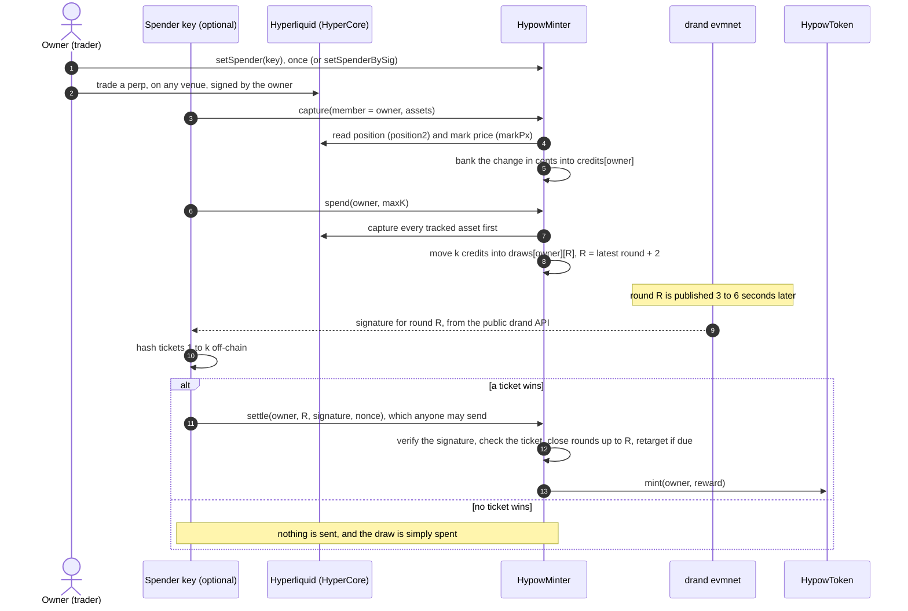

# The Hypow protocol

This document is the protocol's specification in plain English. It is written
for three readers: people who mine, people who build pools or their own miners,
and auditors. It describes the contracts in this repository, which are the ones
that deploy. Where this text and the code disagree, the code in
[`contracts/src/`](contracts/src/) is the authority. Contract addresses are not
listed here, because they change on redeploy. The reference miner's network
configuration, [`miner/src/network.ts`](miner/src/network.ts), carries the
current ones.

## What Hypow is

Hypow is a token mined by trading perpetual futures on Hyperliquid. It has no
premine and no allocation: every token is minted as a block reward to a miner.
Supply is capped at 21,000,000,000 HYPOW.

Hyperliquid has two layers. HyperCore runs the exchange: order books,
positions and margin. HyperEVM is an EVM chain beside it. HyperEVM contracts can
read HyperCore state through precompiles, which are built-in read-only
contracts. Hyperliquid's validators run the core perp markets. Other perp
markets are HIP-3 markets: a third party, the deployer, runs the market and posts its
prices.

Two contracts run on HyperEVM. `HypowToken` is an ERC-20
with a fixed cap and one minter. `HypowMinter` is that minter. The minter never
routes a trade and never holds funds. You trade on Hyperliquid as you normally
would, from any interface. The minter reads your perp positions through
HyperEVM's read-only precompiles, and it turns the change in your positions
into credits. Spending credits buys lottery tickets, one ticket per credit. A
ticket's outcome is decided by a
public randomness beacon, drand, on a round that is published only after the
ticket is bought. A winning ticket mints one block reward. Difficulty adjusts,
as in Bitcoin, so that blocks arrive about once a minute.

In short, trading volume plays the role that hash power plays in Bitcoin. More
volume buys more tickets. It does not buy a bigger reward.

## The mining flow

Mining has three on-chain steps.

1. **Capture** reads your positions and adds the volume you traded since the
   last capture to your bank, which is your credit balance in the minter. One
   credit is one cent of notional.
2. **Spend** moves credits from your bank into a draw. A draw is a set of
   tickets tied to one drand round that has not been published yet. Each credit
   in the draw is one ticket.
3. **Settle** proves that a ticket in the draw won, using drand's signature for
   that round. It mints the block reward to you.

Only you, or the one key you authorize, may capture and spend for you. If you
join a pool, only the pool may capture you. Settle is open to anyone, and the
reward always goes to the draw's owner.
Between spend and settle, the winning check happens off-chain: once drand
publishes the round, anyone can hash the draw's tickets and see whether one
wins. Losing draws are never sent to the chain.

The draw's randomness is explained under [Randomness](#randomness). The
sections below give each step exactly: who may call it, what it reads and
writes, its rules, and its events.

## Permissions: the owner and one spender

The owner is the address that trades on Hyperliquid and receives rewards. The
owner may authorize exactly one other address, its spender. The reference miner
uses a small separate hot key as the spender, so the trading wallet never has to
sign mining transactions or hold HyperEVM gas.

- `setSpender(newSpender)` is called by the owner. It stores
  `spender[owner] = newSpender`. Setting `address(0)` revokes, leaving only the
  owner.
- `setSpenderBySig(owner, newSpender, nonce, deadline, signature)` does the same
  from the owner's EIP-712 signature over
  `SetSpender(address owner,address spender,uint256 nonce,uint256 deadline)`.
  Anyone may submit it, so the owner's wallet needs no HyperEVM gas.

The spender may do everything the owner may do in the minter: capture, spend and
untrack. It cannot change permissions, and it never receives rewards.

Signed permission changes follow these rules:

- The EIP-712 domain is name `HypowMinter`, version `5`, the chain id, and the
  minter's address. Signers must use exactly these values. A signature is
  valid on one deployment on one chain only.
- `nonce` must equal `nonces[owner]`. Every permission change consumes a nonce,
  signed or direct, and spender and pool changes share the counter. So an old
  signature can't be replayed after the owner changed anything.
- `deadline` is a unix timestamp. The signature is valid up to and including it.
- Only plain ECDSA signatures from externally owned accounts are accepted. The
  signature must be 65 bytes, with `v` of 27 or 28 and a low `s` value.

Event: `SpenderSet(owner, spender)`.

Joining a pool uses a second permission, `setCreditDelegate`. It is covered
under [Pools](#pools).

## Capture

Capture turns position changes into credits.

### Who may call it

`capture(member, assets)` takes a member address and a list of perp asset ids.

- A solo member may be captured only by the member or by `spender[member]`.
- A member who has joined a pool may be captured only by that pool. The member
  and the member's spender can no longer capture them.

Capture is restricted because the mark price at the moment of capture prices
the volume. A stranger who could capture you would gain nothing, but could pick
a bad moment for you, such as a dip.

### Baselines and the tracked list

For each (member, asset) pair the minter keeps a slot in `memberSlots`. A slot
holds the last captured position size (`lastSnapshotSzi`), whether a baseline
exists (`known`), and a recorded price (`lastMarkPx`).

- **First capture.** The minter checks the asset is a perp: `perpAssetInfo` must
  report a non-zero maximum leverage, and at most 24 size decimals. A spot id
  reverts with `not a perp`. It then records the member's current position as
  the baseline and credits nothing. Positions held before your first capture
  never count. Otherwise anyone holding a large position at launch would get a
  free bank. Event: `AssetRegistered(member, asset, baselineSzi)`.
- **Flat registration.** If the first capture finds no position, the baseline is
  zero. Your next open is then credited in full. A flat asset is not put on the
  tracked list, so registration cannot bloat it.
- **The tracked list.** An asset is tracked while its baseline is a non-zero
  position. It joins the list when a position opens and leaves when it closes.
  Events: `AssetTracked(member, asset)` and `AssetUntracked(member, asset)`.
- **Closing keeps the baseline.** A closed position leaves the list, but its
  slot stays known at zero. A later re-open is credited from zero, because it is
  new volume.

Every asset id that the position and mark precompiles accept is eligible. That
covers the validator-run perps and every HIP-3 dex, today's and future ones. A
HIP-3 asset uses the precompile's id form, `dex × 10000 + index`.

### Pricing: how a change becomes credits

A capture compares the member's current position with the slot's baseline. It
reads the current mark price through the `markPx` precompile. Each slot also
keeps a recorded price: the mark at the position's last capture, which an
unchanged capture can raise but never lower. The change is then priced in
parts:

- **Growth** (an open or an add) is priced at the current mark.
- **Shrink** (a close or a partial close) is priced at the lower of the recorded
  price and the current mark.
- **A flip** (from long to short, or back) counts as both. The whole old side is
  a close, priced at the lower of the two. The whole new side is an open, priced
  at the current mark.

The recorded price is then updated:

- **After any change**, the recorded price becomes the current mark.
- **On an unchanged capture**, nothing is credited, and the recorded price may
  only rise. If the current mark is higher, it is stored. If it is lower, the old
  price stays.
- **On a first capture of a held position**, the recorded price is the mark read
  then, or 0 if the market has no readable price. With 0, a close captured before
  any priced capture of that position earns nothing.

Each part is `|size| × mark / 10,000` cents. The precompile scales size by
10^szDecimals and the mark by 10^(6 − szDecimals), so the two scalings cancel
and the divisor is the same for every asset. Totals saturate at the `uint128`
maximum rather than overflow.

**Why the shrink is capped.** A HIP-3 market's deployer posts that market's
price. Without the cap, a deployer could wash-trade its own market at $1 and
capture the opens. It then closes both legs at $1 without capturing. Halting the
market has the same effect, because a halt settles both legs at the mark. Nobody
now holds the market, so the deployer can raise the mark to $10 at no risk. When
it finally captures, the minter sees the closes. Without the cap it would price
them at the current $10 mark. With the cap they are priced at $1, the recorded
price. This attack is audit finding V-23.

**Why growth is not capped.** Growth is new volume, exactly like a fresh open.
A position of one lot captured at P, followed by 99 lots added at 2P, should
earn the 99 lots at 2P.

**Why a change stores the current mark.** Suppose a change kept the higher of
the old and new mark instead. A trader could leave a tiny position open through
a high price. When the trader later adds a large position, its close would be
capped at that old high price, not at the price it was added at. That reopens
the attack above.

The cost to an honest trader is on closes only. If the price rose since the
position's last capture, the close is credited at the older, lower price.
Frequent captures keep this small, and every capture after a rise lifts the
recorded price.

### Markets that can't be read

- If the mark can't be read, or reads zero, capture of that asset changes
  nothing. The baseline and tracking are kept, and the volume is credited at the
  next good read.
- In an explicit `capture` call, an asset whose position can't be read makes the
  call revert.
- In the capture that `spend` runs, an unreadable asset is skipped, so one dead
  market can't block your spends.

A market that disappears for good, such as a removed HIP-3 dex, would stay on
the tracked list forever and cost gas on every spend. `untrack(owner, asset)`
removes it. Only the owner or `spender[owner]` may call it, and the asset must
be tracked. It deletes the slot, so the next capture of that asset re-baselines
with no credit. Volume since its last capture is forfeited. Event:
`AssetUntracked(owner, asset)`.

### What capture writes

The credited cents go to `credits[member]`, or to `credits[pool]` if the member
has joined a pool. Credits never expire. `capture` returns the cents captured.

Event: `Captured(member, destination, cents)`, where `destination` is the bank
credited. It is emitted only when the capture credited something.

A trade that opens and closes between two captures leaves the position where it
was. The minter sees no change, and the trade earns nothing. Miners therefore
capture soon after every fill.

## Spend

`spend(owner, maxK)` moves up to `maxK` banked credits into a draw. Only the
owner or `spender[owner]` may call it. When and how much to spend is the
owner's decision.

In order, spend does the following:

1. **Capture tracked assets.** If the owner is solo, spend captures every
   tracked asset into the owner's bank first, so fresh volume is included. A
   pooled owner's fresh volume belongs to the pool, so no capture runs. A
   pooled owner can still spend credits banked before joining.
2. **Take the credits.** `k = min(maxK, credits[owner])`. If `k` is zero, spend
   returns `(0, 0)`, keeping whatever step 1 banked. Otherwise `k` is debited from the
   bank.
3. **Pick the round.** The target is `targetRound() = drandRound(block.timestamp)
   + 2`, where `drandRound(t) = (t − 1727521075) / 3 + 1`, rounded down. That is
   two rounds past the latest round drand has published. It is published 3 to 6
   seconds after the spend.
4. **Check the round is open.** The target must be above `lastWonRound`, or the
   spend reverts with `round closed`. A closed round can never settle, so the
   credits would be burned. This can only happen if `block.timestamp` lags real
   time by about 3 seconds or more.
5. **Add to the draw.** `draws[owner][round] += k`. Two spends in the same round
   add to one draw.

Spend returns the round and `k`. Taking a maximum instead of an exact amount lets
a client quote `k` from a view call without reverting if the bank changed
before the transaction landed.

Event: `Spent(owner, round, k, drawK)`, where `drawK` is the draw's new total.

The draw's outcome is unknowable when it is bought, because its seed is
drand's signature for a round that does not exist yet. See
[Randomness](#randomness) for why that matters.

## Settle

`settle(owner, round, signature, nonce)` cashes one winning ticket. Anyone may
call it. The reward always mints to `owner`, never to the caller.

### Checks

Settle either mints or reverts. In order:

1. `round > lastWonRound`, else `round closed`.
2. `draws[owner][round] > 0`, else `no draw`. Call this amount `k`.
3. `1 ≤ nonce ≤ k`, else `nonce out of range`. A draw of `k` credits holds
   tickets numbered 1 to `k`.
4. The drand signature for `round` verifies, else it reverts (see below).
5. The ticket wins, else `ticket loses`.

A losing ticket reverts and leaves the draw alone. One losing ticket says
nothing about the draw's other tickets. If a loss deleted the draw, anyone could
void a winning draw by submitting a losing nonce.

### Verifying drand's signature

drand evmnet signs each round on the BN254 curve (scheme
`bls-bn254-unchained-on-g1`). The minter checks it like this:

- The signature must be exactly 64 bytes: the x and y coordinates of a G1
  point, as served by drand's HTTP API.
- Both coordinates must be below the field modulus, and the point must be on
  the curve. These checks make the encoding canonical. Each round then has
  exactly one accepted byte string, so the seed can't be varied by re-encoding.
- The signed message is `keccak256` of the round number as 8 big-endian bytes.
  It is hashed to G1 under the domain tag
  `BLS_SIG_BN254G1_XMD:KECCAK-256_SVDW_RO_NUL_`.
- A pairing check verifies the signature against drand evmnet's group public
  key. The key is hardcoded in the contract, not passed at deploy. It is the key
  of chain hash
  `04f1e9062b8a81f848fded9c12306733282b2727ecced50032187751166ec8c3`.

The verifier is the `bls-solidity` library, vendored and pinned. The pairing
check is the most expensive part of settle. Clients compute the outcome
off-chain and send settle only for winning tickets, so in practice it runs once
per block.

### The ticket hash and the target

- The seed is `keccak256(signature)` over the 64 bytes. It is not drand's
  published `randomness` field, which is a sha256. Off-chain tools must hash the
  signature with keccak256 themselves.
- Ticket `nonce` hashes to `keccak256(abi.encode(seed, owner, nonce))`, with
  types `bytes32`, `address` and `uint256`.
- The ticket wins if that hash, read as an unsigned integer, is below
  `type(uint256).max / difficulty`.

So each ticket wins with chance about 1/D, where D is the difficulty. A draw of
`k` tickets wins with chance about `1 − e^(−k/D)`. On average a block takes D
credits of volume, which is D cents.

The ticket is checked against the difficulty at settle time. That is the same
difficulty it was bought at. Difficulty changes only on a win, and any win
cashed after the ticket was bought is on an earlier round. A win on the same or
a later round would have closed this one.

### What a win writes

In order, before any external call:

1. The draw is deleted.
2. `lastWonRound = round`.
3. `winCount` increases by one.
4. The retarget check runs (see [Difficulty](#difficulty)).
5. The reward is computed for block number `n`, the `winCount` before this win,
   counting from 0. It is clamped to the room left under the cap.
6. `wonBy[round]` records the owner, the difficulty the ticket was checked at
   (before this win's retarget), and the reward.
7. The token mints the reward to the owner.

Event: `Won(owner, round, winCount, nonce, reward, caller)`, where `winCount` is
`n`, the 0-based block number. If this win retargets, `DifficultyRetargeted` is
emitted first.

`wonBy` exists for contracts. A pool contract can't read events. Its token
balance rises when someone else settles its win, but nothing tells it which
draw won. `wonBy` lets it look up each round, no matter who settled.

### What closes a round

A cashed win on drand round R closes R and every earlier round. Nothing else
closes a draw, and there is no deadline.

- **A draw can't be closed before its round is published.** Only a cashed win closes
  rounds. Cashing a win on R or a later round needs that round's signature, and
  that signature does not exist before R is published. So every ticket gets its
  chance.
- **A later win closes yours.** If you hold a win on R and someone cashes a win
  on R + 1 first, your round is closed and your win is lost. This pushes winners
  to cash at once, rather than hold a win for a convenient moment, such as
  after a retarget lowers difficulty. See the accepted risk on holding a win.
- **At most one win per round.** A win closes its own round. If two draws win on
  the same round, the first settle to land takes the block.
- **Wins on nearby rounds are fine.** Wins on R and R + 1 both mint if they are
  cashed in round order. Draws on rounds after a cashed win are untouched,
  including the winner's own.

A lost would-be win is the equivalent of a Bitcoin orphan block. It happens when
two winners share a round, or when a slow cash on R loses to a later round's
winner who cashes first.

## Difficulty

Difficulty follows Bitcoin's retarget rule, measured in seconds of
`block.timestamp`, plus a second trigger for sudden crashes in mining volume.

### Parameters

These can never change. The first three are set at deployment. The clamp is a
constant in the source.

| Parameter | Mainnet value | Meaning |
|---|---|---|
| `genesisDifficulty` | 1 | Starting difficulty. At 1, every ticket wins. |
| `targetIntervalSeconds` | 60 | Target time between blocks. |
| `retargetWindow` | 2016 | Blocks between regular retargets. |
| `RETARGET_CLAMP` | 4 | Largest factor of one retarget, either way. A contract constant. |

At these values a full window takes 2016 minutes, 33.6 hours, when blocks arrive
on target. The clock is `block.timestamp`, not HyperCore's L1 block number. The
L1 block number advances many times per second, at a rate that differs per
network and may change.

### The rule

The check runs inside each winning settle, after `winCount` increases. Let
`wins` be the blocks found since the last retarget, this one included. Let
`elapsed` be the seconds since the last retarget, with a floor of one second.

- A retarget happens if `wins` reaches `retargetWindow`. This is the regular
  retarget.
- A retarget also happens if `elapsed` reaches `4 × retargetWindow ×
  targetIntervalSeconds`, about 5.6 days on mainnet. This time trigger exists
  for a sudden crash in mining volume.

When a retarget happens:

1. `expected = wins × targetIntervalSeconds`.
2. `elapsed` is clamped to between `expected / 4` and `expected × 4`.
3. The new difficulty is `difficulty × expected / elapsed`, rounded down, with a
   floor of 1.
4. The window restarts: `lastRetargetTime` and `lastRetargetWinCount` are set to
   now.

Event: `DifficultyRetargeted(oldDifficulty, newDifficulty)`.

At a full window this is exactly Bitcoin's rule. When the time trigger fires,
the window has run at least four times its expected length. The clamp then
applies, so difficulty falls by exactly 4. After a roughly 98% drop in volume, blocks slow about 50 times.
Without the time trigger the next retarget would be months away. With it, difficulty
can fall by 4 every 5.6 days. The time trigger is slow on purpose. Bitcoin Cash's 2017
emergency adjustment fired after 12 hours of slow blocks, and miners gamed it by
leaving and returning. Gaming this one would take most of a week without mining.

Two consequences follow from checking only on a win. While no block is found,
no retarget runs. The time trigger fires at the next win. And the first window is
measured from deployment, not from the first win, because the constructor sets
`lastRetargetTime`.

Credits never expire, so a miner may hold credits while difficulty is high and
spend after a retarget lowers it. The protocol allows this. It can deepen a
drought and sharpen the rush that follows.

## Emission

The reward for block `n`, counting from 0, is

    R(n) = R₀ · e^(−λn)

with R₀ = 12,721.6 HYPOW and λ = 6.058 × 10⁻⁷.

- The reward halves about every 1.14 million blocks. At one block a minute that
  is about 2.2 years. About 27% of supply is minted in the first year at the
  target rate.
- The sum of all rewards approaches R₀/λ, about 20.9997 billion HYPOW. That is
  just under the 21 billion cap.
- The contract stops evaluating the curve at λn ≥ 60, about block 99 million.
  From there the reward is zero. It is already negligible long before.
- A reward is clamped to the room left under the cap. With these constants the
  clamp never binds. It is a safeguard.

The reward depends only on the block number. It does not depend on how many
credits won it.

## The token

`HypowToken` is a plain ERC-20 on HyperEVM: name `Hypow`, symbol `HYPOW`, 18
decimals.

- `CAP` is 21,000,000,000 × 10¹⁸. A mint that would pass it reverts.
- `minter` is set in the constructor and is immutable. Only it may mint.
- There is no owner, no admin, no pause, no burn and no upgrade path.

The deploy script predicts the minter's address, deploys the token bound to it,
then deploys the minter at that address. It checks the two are linked.

## Randomness

### Why not the block hash

HyperEVM offers no usable on-chain randomness.

- `prevrandao` is a constant 0.
- The block hash is grindable. A HyperEVM header hash covers only the parent
  hash, number, timestamp, gas fields, base fee, and the transaction, receipt and
  log roots. It covers no state. Transactions in a block are ordered strictly by
  tip. So a block proposer can try many variants of its own transaction, and
  recompute the hash each time, without touching state. An ordinary user with a
  fast node may be able to do the same by predicting the block's contents. This
  is inferred, not demonstrated.
- Later block hashes don't help. Using block B + k just moves the grinding to
  whichever block comes last.

Any seed that is public, or cheaply predictable, when credits are committed
can be ground. An attacker splits volume over many addresses. It computes
offline which address would win soonest and trades only on that one. The volume
it needs per block falls by the number of addresses. This is audit finding A-1,
and it is why draws are seeded from a round that does not exist yet.

### Why drand evmnet

drand is a public randomness beacon run by the League of Entropy, a group of
independent operators. Each round is a threshold BLS signature. No single
operator can predict or bias it. Only a threshold of them colluding could.

The evmnet network signs on BN254, which HyperEVM's precompiles can verify. It
publishes a round every 3 seconds, from genesis time 1727521075. A draw's round
is published 3 to 6 seconds after the spend, so the wait is short. Verification
costs gas only on a win. drand's other networks sign on BLS12-381, and HyperEVM
has no BLS12-381 precompiles, so they can't be verified on-chain.

Pyth Entropy is not used. It has one provider, who sees outcomes
before revealing them and can withhold. It also charges a fee for every draw.
drand has neither problem.

### Why splitting doesn't help

The seed does not exist when credits are committed, so there is nothing to
grind. Splitting `k` credits into draws of `k₁ … kₙ` over any number of
addresses gives a total win chance of `1 − e^(−(k₁+…+kₙ)/D) = 1 − e^(−k/D)`.
That is the same as one draw. Since each round mints at most once, several
winners on one round can only lose wins. Splitting is never better.

## Pools

A pool lets small miners share wins, so their income is steady instead of lumpy.
The minter supports pools through one hook. It does not implement a pool.

### What the minter does

- `setCreditDelegate(pool)` joins a pool. `setCreditDelegateBySig(owner, pool,
  nonce, deadline, signature)` does the same from an EIP-712 signature over
  `SetCreditDelegate(address owner,address pool,uint256 nonce,uint256 deadline)`,
  under the same rules as the spender signature.
- Passing `address(0)`, or your own address, leaves the pool.
- While you are delegated, only the pool may capture you. Your captured volume
  goes into `credits[pool]`, the pool's own bank. Your own `spend` captures
  nothing. You can still spend credits banked before you joined.
- The pool spends its bank like any owner, through `spend(pool, maxK)` sent by
  the pool itself. Anyone may settle the pool's draws, and wins mint to the pool.
  `wonBy` tells the pool which of its draws won, at what difficulty, and for how
  much.
- Credits already banked stay where they are when you join or leave. Credits
  captured into the pool's bank belong to the pool.

Event: `CreditDelegated(member, pool)`, with `address(0)` for leaving.

### What the minter does not do

The minter keeps no member ledger, pays no member and takes no fee. It does not
check that a pool is a contract, and it keeps no list of pools. How a pool
decides who may trigger captures, how it sizes draws and how it pays members are
all the pool's own design.

The launch deploys no pool. The repository ships `TestPool`, a test-only
contract that proves the hook works end to end. It pays members nothing and is
not a payout design.

### Guidance for pool builders

- **Pay each win by the credits actually drawn, not the credits contributed.**
  A pool's bank fills at once but drains over many draws, oldest credits first.
  Suppose each win paid the most recent contributions. Then a large contribution
  would sit in the bank, fund draw after draw, and its wins would go to whoever
  contributed a little just before. In testing, a pool that did this let a small
  late contributor take most of a large contributor's wins. Instead, give each
  draw a payout window: the range of contributed credits it actually spent. Find
  its end from the pool's total drawn credits, which is total contributed minus
  `minter.credits(pool)`, read right after the spend.
- **Fix a draw's payout window when the pool spends, not when it settles.** The
  round's signature is public before the settle. Anyone could see the draw won
  and join just before it is cashed.
- **Decide who may trigger a member's capture.** Capture timing prices volume,
  so whoever drives a member's captures holds a lever over that member. Don't
  reuse the minter's spender slot for this. It also grants the member's solo
  `spend` and `untrack`.
- **Settle every win promptly and in ascending round order.** Anyone may settle
  the pool's later win first, which closes its earlier ones. Pools draw often
  and are the most exposed.
- **Spend in capped draws.** Large draws take longer to search and so lose
  more wins to later rounds (see [the reference miner's
  policy](#the-reference-miners-policy)).
- **Account for retargets.** A payout window sized in multiples of D changes
  size when D changes. Weighting each credit by 1/D at its draw avoids this.
- **Make claims resumable and bounded,** so no member's payout can outgrow a
  block.

## Immutability

The protocol is deployed once and cannot be changed by anyone.

- There is no owner, admin, governance, pause or upgrade path in either contract.
- The token's minter is set at deploy and is irrevocable. The cap can't be
  raised.
- The difficulty parameters are fixed at deploy. The retarget clamp, the drand
  beacon and its public key are constants in the source.
- There is no allowlist of venues. Every perp dex is eligible, including HIP-3
  dexes that don't exist yet. An allowlist would freeze today's venues forever,
  and an admin able to edit it would break immutability.
- The minter holds no funds and never calls HyperCore's write interface. Your
  funds never leave your Hyperliquid account.

The price of this is that no risk below can be fixed after deploy.

## Accepted risks

These risks are known and accepted. [`contracts/AUDIT.md`](contracts/AUDIT.md)
has the full findings. None lets anyone mint beyond the cap, take another
owner's credits or tokens, or forge a drand seed.

- **A HIP-3 deployer can inflate credits, with margin at risk (V-1).** A
  deployer posts its market's mark. It can wash-trade its own market, keep both
  legs open while it raises the mark, and capture them at the top. Its short leg
  must survive the rise. At ten times the entry mark, the short leg has lost nine
  times its notional, so it must post about that much margin. The
  deterrent is the deployer's staked HYPE, which Hyperliquid can slash. The
  variant with no position at risk is closed by the pricing rule (V-23).
- **HIP-3 volume is counted in the dex's collateral, not in dollars (V-12).** A
  HIP-3 mark is quoted in its dex's collateral token, and the minter reads it as
  dollars. Every live HIP-3 dex uses a dollar stablecoin today, and Hyperliquid
  currently requires $1-pegged quote assets. If a dex on a non-dollar stable is
  ever allowed, its traders would earn credits at that currency's rate. A yen
  stable would give about 150 times the credits per dollar. The precompiles
  expose no collateral field, so no on-chain check is possible without an
  allowlist.
- **An owner can time its own captures (V-2).** Credits are priced at the mark
  when capture runs, not at the fill price. A hedged pair of your own accounts
  can wait and capture opens at a local high, or capture a held position at a
  high so its later close pays that high. Each needs the positions held, with
  margin at risk, while waiting.
- **Difficulty is set by the cheapest venue.** HIP-3 markets can charge far
  lower fees than validator perps. Volume there earns more credits per fee
  dollar, so it sets the difficulty for everyone.
- **drand retirement would stop minting forever (V-3).** Settle verifies only
  drand evmnet. If that network is retired, no draw can settle again. A drand
  stall only pauses settles until the round appears. There is no refund path.
  A refund would let an owner watch a late round's signature and reclaim credits
  only from losing draws.
- **A precompile change could break capture (V-3).** If Hyperliquid changes a
  precompile's interface or scaling, capture stops working or credits at the
  wrong scale, and nothing can be fixed.
- **The randomness trusts drand's threshold.** A colluding threshold of drand
  operators could predict rounds. Every drand user makes this assumption. The
  BLS library upstream is unaudited and archived. The minter vendors it, rejects
  non-canonical signatures, and is tested against real evmnet rounds and
  independent implementations.
- **The spend assumes a fresh block timestamp.** A spend's target round is two
  rounds ahead, so it is published 3 to 6 seconds after the spend. The measured lag of
  `block.timestamp` is under a second. A lag of about 3 seconds would let a
  spender see the target round in time to act on it.
- **Low difficulty is a tip auction (V-6).** At difficulty 1 every ticket wins,
  and only the first settle on a round mints. HyperEVM orders transactions by
  tip. So while difficulty stays below the credits spent per round, each block
  goes to the highest priority fee, not to the most volume. This fades as
  difficulty rises.
- **Large draws lose more wins (V-7).** Finding the winning ticket in a draw of
  `k` tickets takes about `k/2` hashes. A small winner on a later round finds its
  ticket faster, cashes first, and closes the larger draw's round. Capped draw
  sizes keep this small.
- **Anyone can settle your later win first (V-13).** If you hold wins on R and R
  + 1, a stranger can cash R + 1 first. That closes R, and you lose one block.
  Settle each win at once, in ascending order.
- **A winner can hold a win and front-run.** A winner on round R can hold its
  win and watch for rival settles. When a rival on a later round broadcasts a
  settle, the holder sends its own with a higher tip. The holder's settle lands
  first, so both wins mint. Holding wins no extra blocks. It only lets the
  holder choose when its block lands. If the holder misses a rival's settle, it
  loses the win.
- **Subaccounts and vaults can't mine (V-9).** They have no private key. So they
  can't spend, authorize a spender or join a pool, and any credits captured for
  them are stuck. Only main accounts mine.

## Building a miner

Everything a miner needs is public: the minter's views and events, the
Hyperliquid API, and drand's HTTP API. The reference miner lives in
[`miner/`](miner/). This section separates protocol rules from client choices.

### What every client must get right

- Capture after a fill, before the position changes back. A change that is
  undone before the next capture earns nothing.
- `spend` captures only tracked assets. A position opened in an asset that is
  not tracked needs its own `capture` first. That covers an asset whose first
  capture found no position, and an asset never captured.
- After a spend, wait for the target round. Fetch its signature from
  `https://api.drand.sh/v2/beacons/evmnet/rounds/<round>` and use the 64-byte
  `signature` field.
- Search tickets `1` to `k`, where `k` is `draws(owner, round)`. Hash each as
  `keccak256(abi.encode(keccak256(signature), owner, nonce))`. Compare with
  `type(uint256).max / difficulty()` at the time you settle.
- Settle a winner at once. Before resending a failed settle, check
  `lastWonRound`: if it has reached your round, the round is closed, and
  `wonBy(round)` shows who took it.
- Draws are recorded on-chain. After a restart, `Spent` events and
  `draws(owner, round)` for rounds above `lastWonRound` list every draw that
  can still settle.

### The reference miner's policy

These are the reference miner's choices, not protocol rules. Other clients may
choose differently.

- **Capture on every fill.** It follows the owner's fills on Hyperliquid's
  websocket. It waits for HyperEVM to show the new position, then captures.
- **Spend the whole bank in capped draws.** Each draw is
  `max(ceil(D/10), ceil(bank/20))` credits, capped at the bank. The draw size is
  computed from the bank at the start of a spending run. A draw wins at most one
  block, so winning chance past the first win is wasted. Splitting a bank into
  several draws costs nothing, because independent draws add up to the same
  total chance. At D/10 per draw the waste stays under about 5%, and each search
  stays short. The bank/20 floor stops a large bank from being spent one tiny
  draw at a time when D is small.
- **One draw per round.** Each draw waits for its round's signature before the
  next spend.
- **Settle only winners.** The outcome is computed locally, so losing draws are
  never sent.

## FAQ

### Does trading more increase my reward?

No. It increases your odds. Each cent of volume is one ticket. The reward for a
block is fixed by the emission curve and the block number. A block won with ten
tickets pays the same as one won with a million.

### Do my existing positions count?

No. The first capture of an asset records your position at that moment and
credits nothing. Only changes after it count.

### Why did a quick trade earn nothing?

The minter sees only the difference between two captures. If you open and close
before the next capture, your position looks unchanged. The reference miner
captures right after each fill, but a round trip faster than that is missed.

### Which markets mine?

Perps on every perp dex, including HIP-3 dexes deployed by third parties. Spot
does not mine.

### Can someone else capture or spend for me?

Only you, or the one spender you authorized. If you joined a pool, only the pool
can capture you. Anyone can settle a winning draw of yours, and the reward still
mints to you.

### What if my miner stops mid-draw?

Banked credits never expire, and a losing draw costs nothing further. A winning
draw is different. It stays valid only until someone cashes a win on the same
round or a later one. With a block about every minute, that usually happens
within minutes, so a stopped miner usually loses its unsettled win. On restart,
the reference miner reads its open draws from the chain and settles any
winner.

### Why can't wash trading with my own accounts farm blocks?

Wash trading between your own accounts is volume like any other. It earns
credits, and you pay trading fees on both legs. That is the cost of mining, just
as electricity is in Bitcoin. What it can't do is earn more chances per dollar
than anyone else. A draw's seed is published only after you commit, so you can't
pick a winning account, moment or split. See [Randomness](#randomness).

### Is there a mining pool?

Not from the project. The minter provides the delegation hook, and pools are
left to the community. See [Pools](#pools).

### Can the rules change?

No. There is no admin and no upgrade path. See [Immutability](#immutability).

---

*See [`README.md`](README.md) to build and run the miner and contracts, and
[`contracts/AUDIT.md`](contracts/AUDIT.md) for the audit.*
