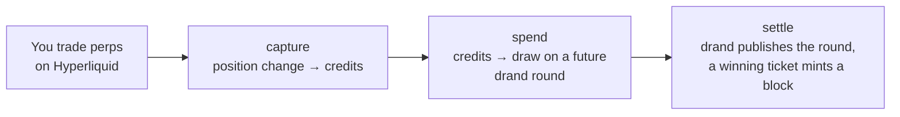

# Hypow

**Proof-of-trade money on Hyperliquid.** You mine HYPOW by trading perps on Hyperliquid, the way you already do. Each cent your positions change by is one ticket for the next block. No premine, no allocations, no admin keys.

[Website](https://hypow.xyz) · [Protocol](PROTOCOL.md) · [npm](https://www.npmjs.com/package/hypow) · [Minter on HyperEVMScan](https://hyperevmscan.io/address/0x14aE637542B6a125217EE477B756504ff009d506)

| | |
|---|---|
| Network | HyperEVM mainnet (chain id 999) |
| Token (HYPOW) | [`0x69321D4a9993660dfE632D3d86685017155696c2`](https://repo.sourcify.dev/999/0x69321D4a9993660dfE632D3d86685017155696c2) |
| Minter | [`0x14aE637542B6a125217EE477B756504ff009d506`](https://repo.sourcify.dev/999/0x14aE637542B6a125217EE477B756504ff009d506) |
| Supply cap | 21,000,000,000 HYPOW |
| Block target | one block a minute |
| Difficulty | retargets every 2,016 blocks, by at most ×4 |
| Randomness | [drand](https://drand.love) evmnet, verified on chain |
| Emission | about 12,700 HYPOW per block at launch, halving about every 2.2 years |
| Admin | none: no owner, no upgrades, no pause |

Both contracts are verified on Sourcify; the links above open the verified source.

## Start mining

You need a Hyperliquid account that trades perps, a browser wallet for the same address, and a little HYPE on HyperEVM (0.01 by default) for the miner's gas.

**In the browser.** Open [hypow.xyz](https://hypow.xyz), switch to the **miner** tab and connect your wallet. It mines while the tab is open.

**From the command line.** Node 22.18 or newer:

```bash
npx hypow mine
```

The first run:

1. Creates a small **miner key**, a separate wallet that pays the mining gas. Your trading wallet's key stays in your browser wallet.
2. Asks for a HyperEVM RPC URL. Press Enter to use the public ones, or paste your own (a free one from any provider works better; see below).
3. Opens a local page where your wallet authorizes the miner key and sends it a little HYPE for gas (0.01 by default).

Then trade on Hyperliquid as usual. The log shows each trade being **captured**, a **ticket** being played, and any **block** you find. Rewards go to your trading wallet.

`npx hypow --help` lists the options: `--rpc`, `--gas`, `--owner` (authorize by hand, without a browser) and `--no-browser` (for servers).

### Good to know

- **Only new trading counts.** Positions you hold when you start mining are the starting point and earn nothing.
- **Hold a trade until it's captured.** The contract credits the change in your position between two captures. A trade that opens and closes before the miner captures it (a few seconds) earns nothing.
- **Perps only.** Every perp market mines, builder-deployed (HIP-3) markets included. Spot doesn't.
- **Use your own RPC if you trade often.** The public HyperEVM endpoints are rate-limited per IP. Over the limit it refuses every call for about a minute, and the miner stalls. The miner warns you when that happens.
- **Keep the miner key topped up.** When it runs low, mining pauses and the miner prints the address to send HYPE to (the browser miner has `/topup`). It resumes by itself once the HYPE arrives.

## How it works

The minter never touches your trades. It only reads your Hyperliquid positions from HyperEVM, through Hyperliquid's read precompiles, and turns position changes into lottery tickets.



1. **Capture.** The miner asks the minter to read your positions. The dollar size of the change since the last capture is banked as credits, one per cent traded.
2. **Spend.** Credits go into a draw on a drand round that hasn't been published yet, so nobody can know the outcome in advance.
3. **Settle.** When drand publishes the round, anyone can check the draw. Each credit is one ticket. A ticket whose hash falls under the difficulty target wins the block reward.

A few rules shape the game:

- **At most one block per drand round.** drand publishes a round every 3 seconds. A block found on a round closes that round and every earlier one, so a win cashed late can be lost to a later one. The miner cashes wins at once.
- **Difficulty** is the expected trading volume per block. It started at one cent and retargets every 2,016 blocks toward one block a minute, like Bitcoin. If a window runs longer than about 5.6 days (4× its target), the next block found cuts difficulty by 4.
- **Splitting doesn't help.** Your chance depends only on the credits you commit, not on how many addresses hold them.
- **Pools** are possible: an address can delegate its credits to a pool contract. Pools are left to the community, and none is deployed.

[PROTOCOL.md](PROTOCOL.md) is the full specification: every function, the pricing rules, randomness, pools, and the accepted risks.

## Trust

- **Immutable.** The token's only minter is fixed at deployment. Nobody can raise the cap, change parameters, upgrade or pause anything.
- **Verifiable randomness.** Every win carries drand's BLS signature for its round, checked on chain.
- **Tested, not audited.** The contracts have unit, fuzz, invariant and differential tests, symbolic proofs with [Halmos](https://github.com/a16z/halmos), and live checks against the real precompiles. There has been no external audit. [PROTOCOL.md](PROTOCOL.md#accepted-risks) lists the known risks.
- **Signed provenance.** The npm package is published from this repository by GitHub Actions, with an [npm provenance](https://docs.npmjs.com/generating-provenance-statements) statement linking it to the tagged commit.

## Repository

| Path | What it is |
|---|---|
| [`contracts/`](contracts) | The token and the minter (Solidity, Foundry), with tests and deploy scripts. Dependencies are vendored under `lib/`. |
| [`miner/`](miner) | `hypow`, the reference miner: the CLI and the browser miner share one mining loop (TypeScript, viem). |
| [`site/`](site) | hypow.xyz: the whitepaper, the live blocks list and the browser miner. |
| [`PROTOCOL.md`](PROTOCOL.md) | The protocol specification. |

## Development

### Miner

```bash
cd miner
npm ci              # installs and builds dist/
npm run typecheck && npm test
cd .. && npx ./miner mine   # run the CLI from the checkout
```

The mining loop lives in `src/core.ts` and runs in both the CLI and the browser. `npm run build` bundles the browser miner into `dist/hypow-miner.js` and copies it into `site/`. The CLI keeps its key, owner and RPC in `~/.hypow/mainnet`; set `HYPOW_HOME` to use another directory. `DEBUG=1` prints full errors.

### Website

```bash
npm ci --prefix miner                     # builds site/hypow-miner.js
cd site && python3 -m http.server 8000    # http://localhost:8000
```

`index.html` is the whole page. Wallets don't inject into pages opened from a file, so serve it over http. Deploying is copying `site/` to any static host.

### Contracts

Requires [Foundry](https://book.getfoundry.sh/).

```bash
cd contracts
forge build
forge test                              # unit, fuzz, invariant and BLS differential tests
uvx --from halmos==0.3.3 halmos         # symbolic proofs
script/live-e2e.py                      # this build's code against the live chain, no transactions
```

The `forge` tests mock Hyperliquid's read precompiles. `live-e2e.py` covers the real ones: it runs the compiled contracts against HyperEVM mainnet with `cast call --override-code`, so it needs no key and sends nothing. It checks the precompile ids and scaling, capture pricing and the drand verifier, each with a negative control. Pass `RPC=<url>` to use your own endpoint.

To deploy, `script/local-deploy.sh` targets a local Anvil node, and `script/deploy.sh` targets HyperEVM. Every genesis parameter must be passed explicitly, because none can change afterwards:

```bash
DEPLOYER_ACCOUNT=<foundry keystore> RPC_URL=https://rpc.hyperliquid.xyz/evm \
GENESIS_DIFFICULTY=1 TARGET_INTERVAL_SECONDS=60 RETARGET_WINDOW=2016 \
script/deploy.sh
```

## License

[MIT](LICENSE)

